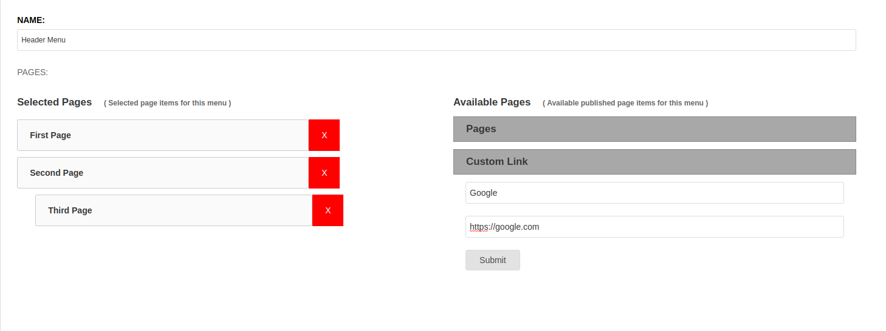

Django CMS Custom Menu
======================

An extension for Django CMS that allows you to create multiple menus like Wordpress. This is compatible for Python 3.6, Django 2.1.9, django-cms 3.6.0

Replaces Previous Versions
--------------------------
**This replaces the previous versions by Ryan Bagwell and Rogerio Carrasqueira which are no longer actively updated**

Originally forked from:

- https://github.com/rgcarrasqueira/django-cms-named-menus
- https://github.com/ryanbagwell/django-cms-named-menus
- https://github.com/mcldev/djangocms-named-menus

Installation
------------

1. Install with pip ``pip install djcms-custom-menu``

2. Add ``djcms_custom_menu`` to INSTALLED_APPS

3. Run migrations ``python manage.py migrate``

Usage
-----

After installation, place the ```` template tag where you want your menu to appear.

.. code::

  

  <ul>
    
  </ul>

Next, create your menu in the admin area using the drag and drop interface.

Drag or add button click to add items as menu items:

You can also add external website links as menu item.

Add button click to add external website link as menu items:

Settings
--------
The following settings can be changed by adding to your project's settings.py file:

1. Override the default cache duration for DJCMS Custom Menu, default = 0 seconds

.. code::

  DJCMS_CUSTOM_MENU_CACHE_DURATION = 3600

2. Set the application namespaces that can be used with DJCMS Custom Menus as a list, default is CMS pages only - as the page id will not be unique for other applications e.g. Aldryn NewsBlog etc. default = ['CMSMenu',]

.. code::

  DJCMS_CUSTOM_MENU_NAMESPACES = ['CMSMenu',]

or to allow all namespaces:

.. code::

  DJCMS_CUSTOM_MENU_NAMESPACES = None

N.B.: Just feel free to contact for any query and help
------------------------------------------------------

Abdullah Al Arafat | imbipul9@gmail.com | +8801712192445 

